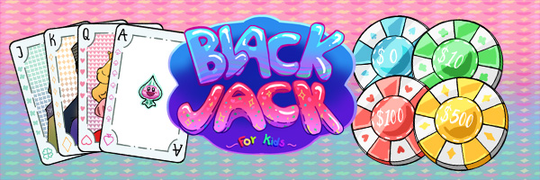
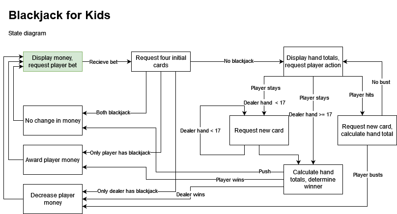
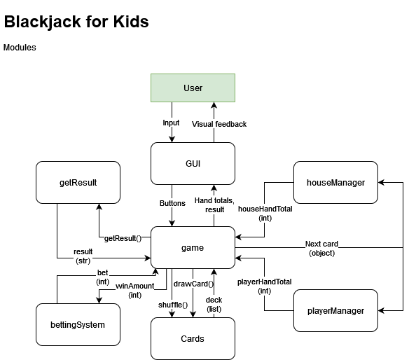

# Blackjack for Kids

_Blackjack for Kids_ is a fun and educational blackjack game designed with a playful Candy Crush theme specifically tailored for children. It aims to provide an entertaining way for kids to learn basic arithmetic skills while having a blast!

---

## Table of Contents

- [Blackjack for Kids](#blackjack-for-kids)
  - [Table of Contents](#table-of-contents)
  - [Features](#features)
  - [Installation](#installation)
  - [Gameplay](#gameplay)
    - [Objective:](#objective)
    - [Rules:](#rules)
    - [Controls:](#controls)
  - [Contributing](#contributing)
  - [Authors](#authors)
  - [Diagrams](#diagrams)

---

## Features

- Colorful and cartoony graphics to engage young players.
- Simplified gameplay mechanics suitable for children aged 6 and above.
- Helps kids learn and improve mental arithmetic by practicing addition skills up to 21.

---

## Installation

To get started with _Blackjack for Kids_, follow these simple steps:

1. Clone this repository to your local machine.
   - ```
     git clone https://github.com/svasim1/blackjack-for-kids
     ```
2. Open the `index.html` as a local server. You can use the Live Server extension in Visual Studio Code or any other local server of your choice.
3. Start playing and enjoy the game!

---

## Gameplay

### Objective:

The objective of _Blackjack for Kids_ is to get as close to 21 as possible without exceeding it.

### Rules:

1. Each player is dealt two cards initially.
2. Players can choose to "hit" to receive another card or "stand" to keep their current total.
3. The player whose total is closest to 21 without exceeding it wins the round.
4. Face cards (Jack, Queen, King) are worth 10 points, and Aces are worth 11 unless the total exceeds 21, in which case they are worth 1.

### Controls:

- Click on the "Hit" button to draw another card.
- Click on the "Stand" button to keep your current hand and end your turn.

---

## Contributing

Contributions are welcome! If you have any suggestions, bug fixes, or enhancements, feel free to open an issue or create a pull request.

---

## Authors

- [@svasim1](https://github.com/svasim1)
- [@Abb22TedStr](https://github.com/Abb22TedStr)
- [@abbjullin](https://github.com/abbjullin)

## Diagrams

(old, may not be 100% correct)



